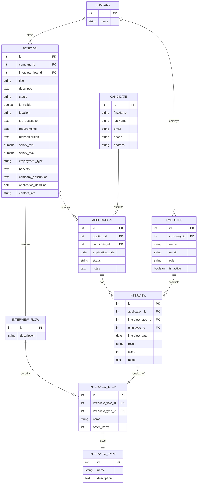

# Prompt 1 para Claude 3.7 thinking y usando el modo ask

Como experto en prompt engineering, buenas practicas de prompting y como experto en bases de datos y normalización. Construye un prompt utilizando el contexto del @README.md y las siguientes instrucciones "procede a convertir el ERD en formato mermaid que te proporcionamos, a un script SQL. Analiza la base de datos del código actual y el script SQL y expande la estructura de datos usando las migraciones de Prisma.Recuerda aplicar buenas practicas, como la definición de Indices y la normalización de la base datos, ya que el ERD proporcionado no cuenta con ello. 
ERD:
erDiagram
     COMPANY {
         int id PK
         string name
     }
     EMPLOYEE {
         int id PK
         int company_id FK
         string name
         string email
         string role
         boolean is_active
     }
     POSITION {
         int id PK
         int company_id FK
         int interview_flow_id FK
         string title
         text description
         string status
         boolean is_visible
         string location
         text job_description
         text requirements
         text responsibilities
         numeric salary_min
         numeric salary_max
         string employment_type
         text benefits
         text company_description
         date application_deadline
         string contact_info
     }
     INTERVIEW_FLOW {
         int id PK
         string description
     }
     INTERVIEW_STEP {
         int id PK
         int interview_flow_id FK
         int interview_type_id FK
         string name
         int order_index
     }
     INTERVIEW_TYPE {
         int id PK
         string name
         text description
     }
     CANDIDATE {
         int id PK
         string firstName
         string lastName
         string email
         string phone
         string address
     }
     APPLICATION {
         int id PK
         int position_id FK
         int candidate_id FK
         date application_date
         string status
         text notes
     }
     INTERVIEW {
         int id PK
         int application_id FK
         int interview_step_id FK
         int employee_id FK
         date interview_date
         string result
         int score
         text notes
     }

     COMPANY ||--o{ EMPLOYEE : employs
     COMPANY ||--o{ POSITION : offers
     POSITION ||--|| INTERVIEW_FLOW : assigns
     INTERVIEW_FLOW ||--o{ INTERVIEW_STEP : contains
     INTERVIEW_STEP ||--|| INTERVIEW_TYPE : uses
     POSITION ||--o{ APPLICATION : receives
     CANDIDATE ||--o{ APPLICATION : submits
     APPLICATION ||--o{ INTERVIEW : has
     INTERVIEW ||--|| INTERVIEW_STEP : consists_of
     EMPLOYEE ||--o{ INTERVIEW : conducts
Entregable esperado: Los cambios de modelo y la migración .sql en la carpeta backend/prisma"

# Prompt 2 para Claude 3.7 modo agent

## Contexto
Trabajas con un sistema de seguimiento de talento (LTI - Talent Tracking System) que utiliza React en frontend, Express con TypeScript en backend y Prisma como ORM para PostgreSQL.

@README.md

## Tarea
Transforma el siguiente diagrama ERD en un script SQL completo y mejórado. Este modelo representa un sistema de gestión de candidatos, posiciones, entrevistas y empresas.

## Requisitos
1. Analiza la estructura actual de Prisma en el proyecto
2. Crea el script SQL correspondiente al ERD proporcionado
3. Mejora el modelo añadiendo:
   - Índices apropiados para búsquedas frecuentes
   - Normalización adecuada donde sea necesario
   - Restricciones de integridad referencial
   - Valores por defecto significativos
   - Campos de timestamp para seguimiento (created_at, updated_at)
   - Campos para soft-delete donde sea apropiado

## Entregable
- Archivo de migración .sql para la carpeta backend/prisma @backend
- Esquema de Prisma actualizado (schema.prisma)

## Consideraciones
- El modelo actual ya tiene implementadas algunas entidades como CANDIDATE
- Asegúrate que la migración sea compatible con PostgreSQL
- Incluye comentarios explicativos en el código SQL
- Prioriza rendimiento en consultas frecuentes

# Prompt 3 para Claude 3.7 modo agent 

- Este prompt se hizo con la finalidad de refinar más el resultado, dejarlo documentado y que fuera más clara la definición.

Excelentes mejoras, me gustaría que esta migración la dejemos en un nuevo fichero para distinguirlo y en dado caso poder fasear dicho proceso. Adicionalmente me gustaría que dentro de este nuevo fichero dejemos la documentación de los cambios de la nueva migración y la justificación por la que se hizo cada cambio.